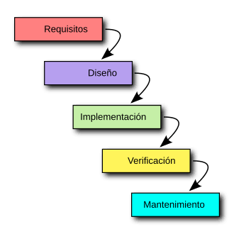

# Introducción al software

## ¿Qué es un programa informático?

Un programa informático es una pieza de software, es decir, una secuencia compleja de instrucciones y procesos orquestados para cumplir una tarea específica en un ordenador o varios.

Sirven para distintas tareas.

## Diferencia entre código fuente, código objeto y código ejecutable

### Código fuente

Es la expresión en un lenguaje de programación de los algoritmos y soluciones ideados por el desarrollador de software. 

Lo que utilizan los programadores para programar.

### Código objeto

 El código objeto es un archivo binario generado por el compilador a partir del código fuente.

### Código ejecutable

 El código ejecutable es un archivo binario que puede ser ejecutado directamente por el sistema operativo.

## Etapas del desarrollo del software

El desarrollo de software se puede dividir en varias etapas:

1. **Análisis de requisitos:** se identifican las necesidades y objetivos del programa.
2. **Diseño:** se establece cómo funcionará el software y cómo se organizarán sus componentes.
3. **Implementación:** los programadores escriben el código del programa.
4. **Pruebas:** se comprueba que el programa funciona correctamente y se buscan posibles errores.
5. **Despliegue:** el programa se instala y se pone a disposición de los usuarios.
6. **Mantenimiento:** se corrigen errores y se realizan actualizaciones y mejoras.

## Imagen

## Repositorio

[Ver el repositorio en GitHub](https://github.com/Vaitiarecf/1DAMP_CamachoFreije_Vaitiare)
